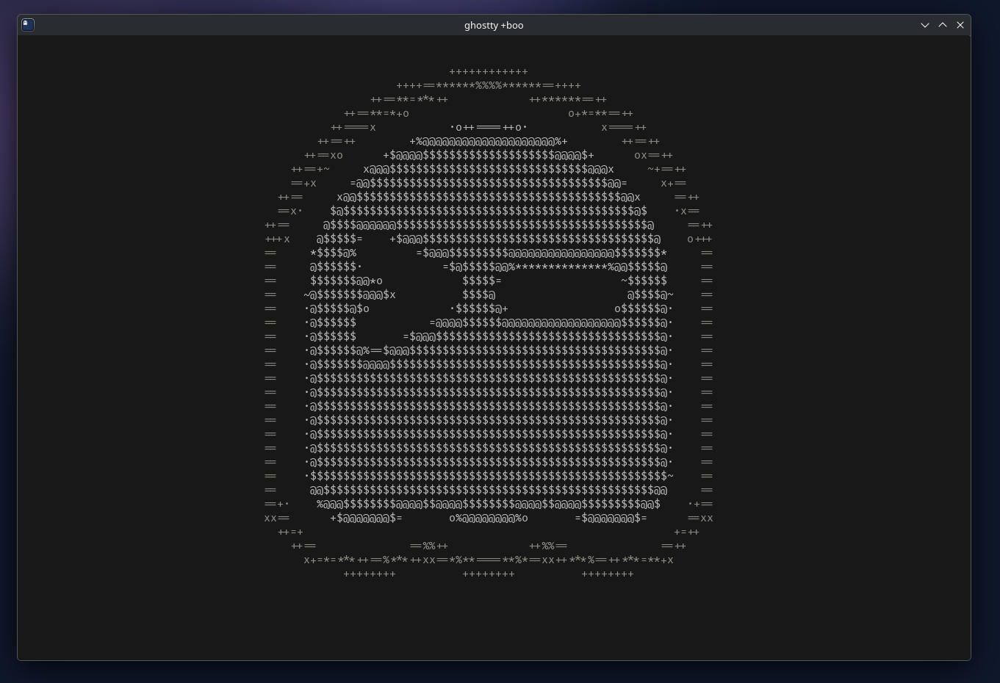
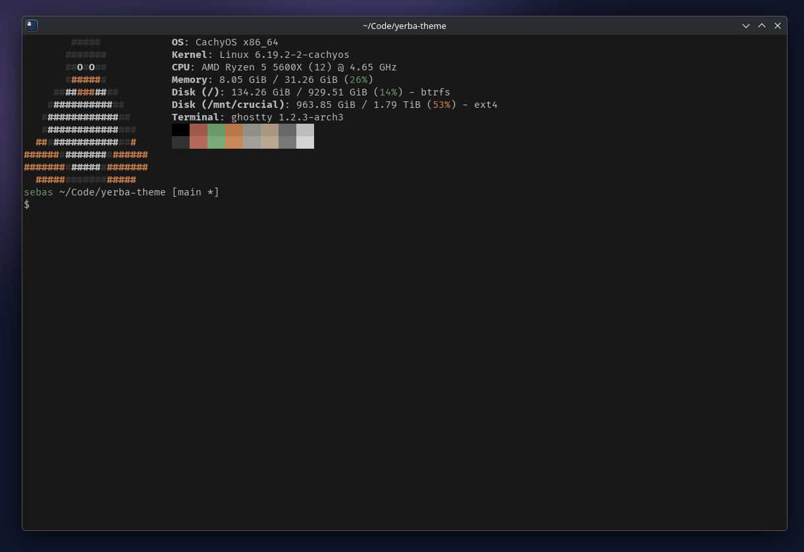

# Ghostty

## Install

```sh
./install.sh ghostty
```

Then add to your Ghostty config:

```
theme = yerba
```

## Screenshots

<details>
<summary>Boo</summary>

</details>

<details>
<summary>Fetch</summary>

</details>
