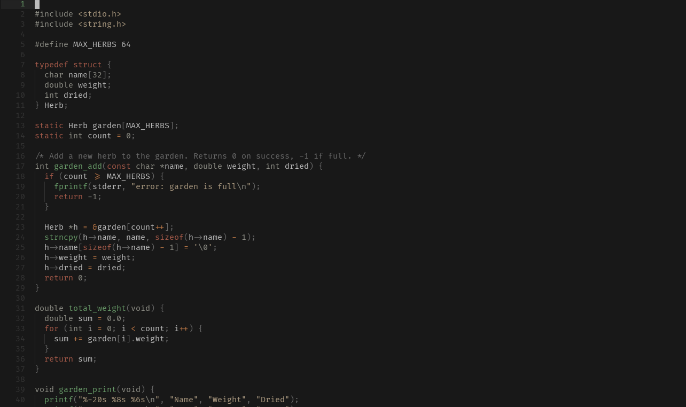
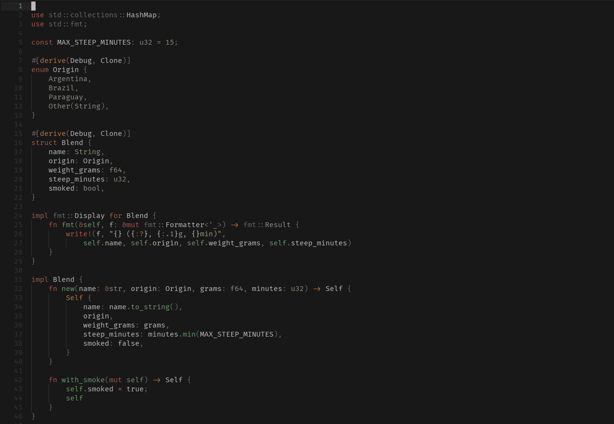
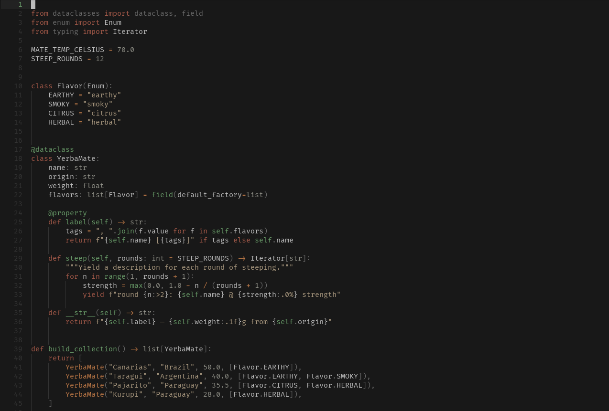
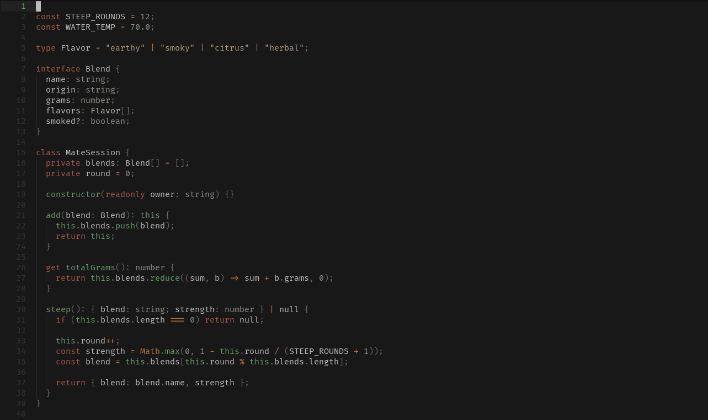
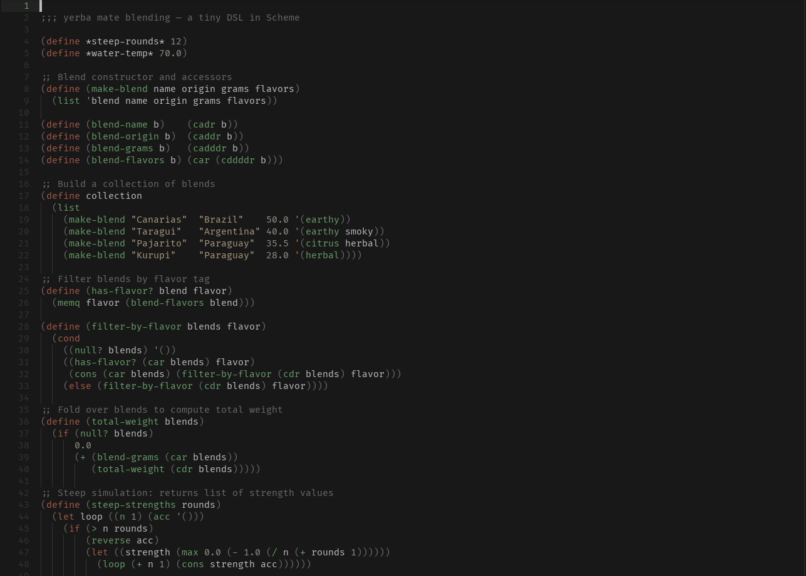

# Helix

## Install

```sh
./install.sh helix
```

Then add to `~/.config/helix/config.toml`:

```toml
theme = "yerba"
```

## Screenshots

<details>
<summary>C</summary>

</details>

<details>
<summary>Rust</summary>

</details>

<details>
<summary>Python</summary>

</details>

<details>
<summary>TypeScript</summary>

</details>

<details>
<summary>Scheme</summary>

</details>

<details>
<summary>Markdown</summary>

</details>
